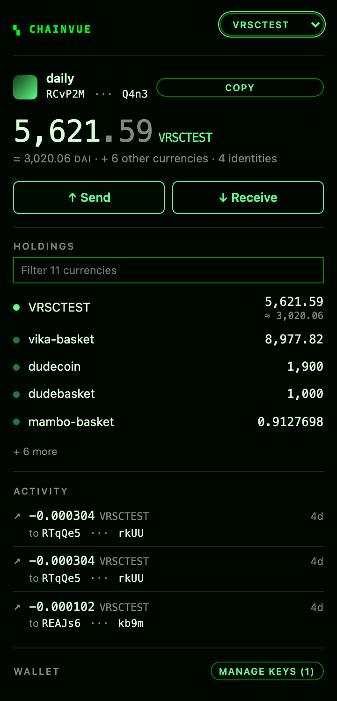
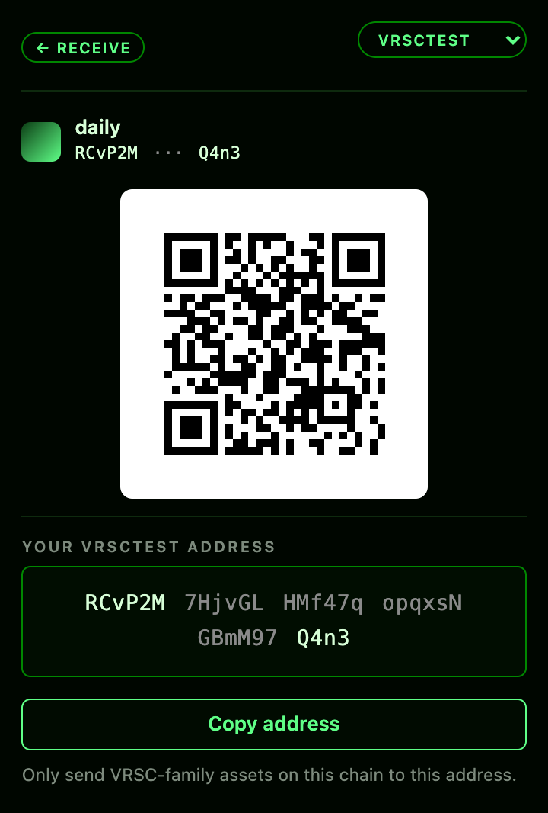
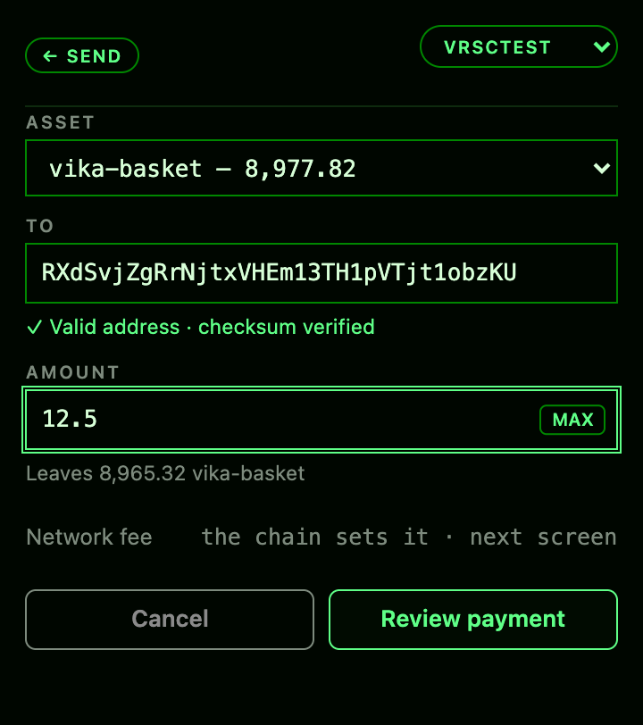
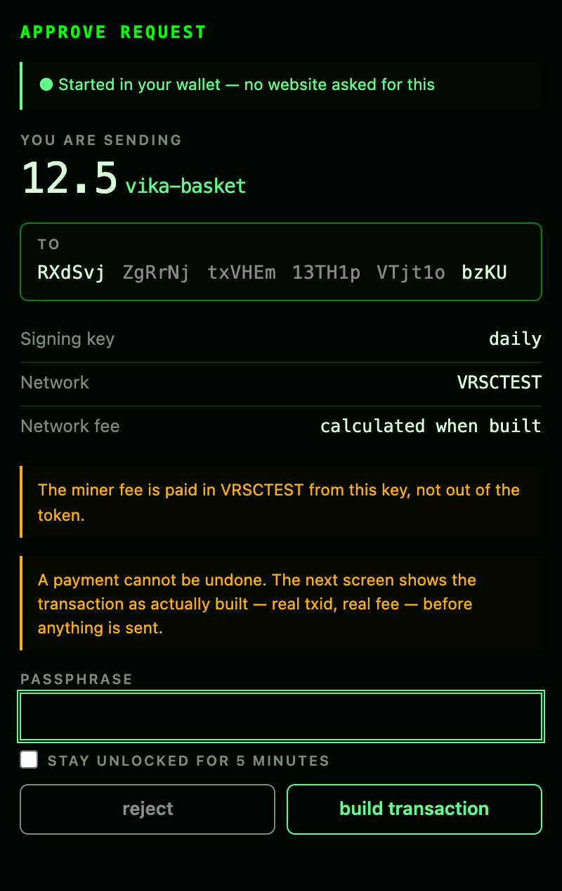

# chainvue web wallet

A Verus wallet that lives in your browser.

Your keys are made on your own computer and encrypted with a passphrase you
choose. They never leave the machine, and there is no account to sign up for.
Before anything is sent, the wallet shows you the transaction it actually
built — the real fee, the real destination — and nothing reaches the chain until
you press Broadcast.

> **It has not been audited.** Please read
> [Before you trust it with real money](#before-you-trust-it-with-real-money).

<table>
  <tr valign="top">
    <td width="25%"></td>
    <td width="25%"></td>
    <td width="25%"></td>
    <td width="25%"></td>
  </tr>
  <tr valign="top">
    <td><b>Everything you hold</b><br>Coins, tokens, and what identities you control hold — priced where the chain can price it.</td>
    <td><b>Get paid</b><br>A QR for a phone, and the address grouped so it can be checked against a source.</td>
    <td><b>Send</b><br>To an address or a name like <code>alice@</code>. A typo fails the checksum before anything is built.</td>
    <td><b>Approve</b><br>Your passphrase signs; the next screen shows the built transaction before it is broadcast.</td>
  </tr>
</table>

<sub>Real screens, captured from the running extension against live VRSCTEST by
<code>npm run screenshots</code>.</sub>

## Install it

There is no Chrome Web Store listing yet, so you install it yourself. The first
way needs nothing installed and takes about two minutes.

### The quick way — download a build

Works the same on **macOS, Windows and Linux**.

1. **Download** `chainvue-web-wallet-<version>.zip` from
   [the latest release](https://github.com/chainvue/chainvue-web-wallet/releases/latest).
   It is built by GitHub Actions, not by hand.
2. **Unpack it** somewhere you will keep — the extension is loaded from this
   folder every time your browser starts, so it cannot be a temporary one.

   | | |
   | --- | --- |
   | **macOS** | Double-click the zip. |
   | **Windows** | Right-click → **Extract All**. Extract it properly: Chrome cannot load an extension out of the folder Explorer shows you when you just double-click a zip. |
   | **Linux** | `unzip chainvue-web-wallet-*.zip -d chainvue-wallet` |

   The unpacked folder must contain **`manifest.json`** at its top level.
3. **Open your browser's extensions page** — `chrome://extensions`, or
   `brave://extensions`, or `edge://extensions`.
4. Turn on **Developer mode** (a switch, usually top right).
5. Click **Load unpacked** and choose the unpacked folder.
6. The wallet icon appears in your toolbar. **Pin it** so it stays visible.

To update: download the new zip, unpack it over the same folder, and press
**Reload** on the extensions page. Your keys live in the browser's storage, not
in the folder, so they survive.

<details>
<summary>Check the download is the file CI published (optional)</summary>

Every release carries a `.sha256` next to the zip. Compare it with what you have:

```sh
shasum -a 256 chainvue-web-wallet-*.zip     # macOS
sha256sum chainvue-web-wallet-*.zip         # Linux
```

```powershell
Get-FileHash chainvue-web-wallet-*.zip -Algorithm SHA256   # Windows
```

The result should match the contents of the `.sha256` file on the release page.
</details>

### The other way — build it yourself

You need [Node.js](https://nodejs.org) 18+, and [Rust](https://rustup.rs) with
`wasm-pack` — the signing code is compiled from Rust and is not committed:

```sh
cargo install wasm-pack

git clone https://github.com/chainvue/chainvue-web-wallet.git
cd chainvue-web-wallet
npm install
npm run package
```

That leaves **`dist/unpacked`**. Load that folder at step 3 above.

### Which browsers work

Any Chromium browser, version 116 or newer — Chrome, Brave, Edge, Opera,
Vivaldi, Arc. **Firefox and Safari will not work**: they handle extension
background scripts differently, so the wallet would need changes first.

Chrome may warn about extensions in developer mode each time it starts. That is
what installing outside the store looks like; nothing is wrong.

## First time

1. Click the wallet icon, choose a name and a passphrase, then **create wallet**.
2. **Write the passphrase down.** It is the only thing that opens your wallet.
   Nobody — including us — can reset it. If you lose it, the coins are gone.
3. **Back it up.** Open **Manage keys → Back up**, type your passphrase, and
   write down the key it shows you. The passphrase only unlocks what is stored
   in *this* browser: if the browser goes, so do the coins.
4. You start on **VRSCTEST**, the test network, where coins are worth nothing —
   the right place to learn it. Mainnet is cyan instead of green and wears a bar
   across the top, so you always know which chain you are on, including on the
   window that signs.

Press **Receive** to be paid, **Send** to pay someone.

## What you can do

- Create a wallet, or import one you already have — and **back it up**
- Keep several accounts and switch between them
- See what you hold: coins, tokens, and balances held by identities you control,
  priced in DAI where the chain can price them
- Send to an address or to a VerusID name like `alice@`
- Check recent payments — how much, to whom, and whether they confirmed
- Claim a VerusID name, launch a token or a currency, and convert between them

## Before you trust it with real money

- **No audit.** Nobody has reviewed this code for security.
- **No hardware wallet support**, and no air-gapped signing.
- **No spending limits and no trusted sites.** Every request opens a window.
- **Staying unlocked is optional.** Tick it and the wallet stops asking for your
  passphrase for five minutes. Leave it alone and it asks every time.
- **Mainnet is selectable.** Nothing stops you pointing it at real VRSC. On
  current evidence, you should not.

What is done: the encryption is the browser's own (PBKDF2-SHA256 at 600,000
iterations, AES-GCM-256) with nothing hand-rolled, and every byte the wallet
signs comes from the Verus Rust SDK, pinned to the same version the `pecu`
command-line tool uses.

## For developers

How it is put together, why approval happens in two stages, and the reasoning
behind the trust boundaries: **[docs/design.md](docs/design.md)**.

```sh
npm test            # end-to-end, in a real browser, against live testnet
npm run package     # build the extension into dist/
npm run screenshots # re-capture the images above from the running wallet
```

Releases are decided by commit messages: `fix:` or `feat:` proposes one, `docs:`
does not. A pull request stays open showing the next version and the changelog,
and merging it publishes. Builds run in GitHub Actions rather than by hand, and
every release carries a SHA-256. The Rust toolchain is pinned in
`wasm/rust-toolchain.toml` and every dependency in `wasm/Cargo.lock` — but the
build is not yet bit-for-bit reproducible; see
[docs/design.md](docs/design.md#reproducibility).

[Privacy policy](PRIVACY.md) · Apache-2.0, matching the SDK.
